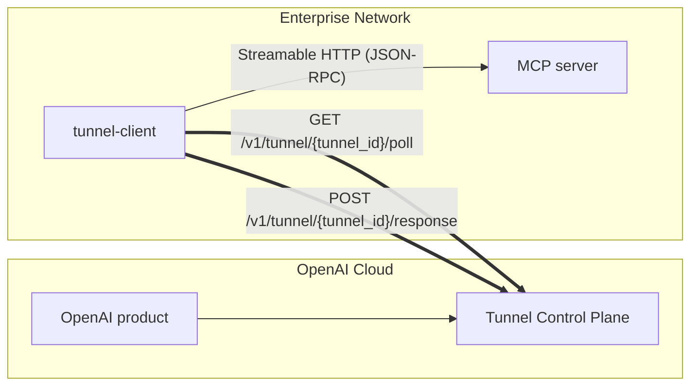

# Architecture

`tunnel-client` is a single-process agent that bridges the tunnel control plane with your internal MCP server.

## High-level data flow

## Runtime components (code map)

- **CLI / process entry**
  - `cmd/client`: loads config, wires Fx, starts the app.
- **Configuration**
  - `pkg/config`: flag/env parsing, validation, defaults.
- **Control plane**
  - `pkg/controlplane`: builds the HTTP client and runs the poll loop.
- **Dispatcher**
  - `pkg/dispatcher`: bounded in-memory queue sized by `control-plane.max-inflight`.
  - `pkg/dispatcher/internal`: worker pool sized by `mcp.max-concurrent-requests`, forwards to MCP, posts responses back.
- **MCP client**
  - `pkg/mcpclient`: Streamable HTTP MCP transport, header forwarding, startup probe.
- **Channel state**
  - `pkg/adminui`: embeds the admin UI, including runtime channel status reporting.
- **Ops surface**
  - `pkg/health`: `/healthz`, `/readyz`, `/metrics`.
  - `pkg/metrics`: Prometheus exporter + OTel meter provider.
  - `pkg/process`: optional PID file lifecycle.

## Important behaviors / current limitations

- **Outbound-only**: the tunnel itself requires no inbound connectivity. The only inbound port is the optional local admin server.
- **Queueing/backpressure**: the control-plane poller requests up to the number of available slots in the bounded queue to avoid unbounded buffering.
- **Progress/notifications**: MCP JSON-RPC notifications are posted via `/v1/tunnel/{tunnel_id}/response` using `resp_type=jsonrpc_notify` and are forwarded to the connector when SSE is enabled.
- **Streaming semantics**: the client can stream intermediate JSON-RPC notifications over SSE when the connector requests `text/event-stream`, then posts a final JSON-RPC response to close the stream.
- **Connector GET not supported**: `/v1/mcp` only accepts POST requests; `GET /v1/mcp` does not provide an SSE stream.
- **Channel routing**:
  - `main` commands route to the configured MCP transport (`http-streamable`, `stdio`, or `in-memory`).
  - `harpoon` commands route to the embedded Harpoon server (in-memory transport) and are enabled only when at least one Harpoon target is registered.
  - OAuth discovery is only supported on `main`; `harpoon` rejects `oauth_discovery` commands with `unsupported_channel`.
- **Harpoon target semantics**: `list_targets` publishes per-target metadata (`category`, `source`, `tags`) so callers can resolve targets by intent (for example, OAuth metadata endpoints) without relying on label naming.

## OAuth-protected MCP

- Forwards inbound `Authorization` headers to the MCP server via tunnel-client.
- Handles OAuth discovery by queuing `oauth_discovery` commands; discovery GETs flow through the tunnel-client.
- Rewrites `WWW-Authenticate` `resource_metadata` and discovery payload `resource` URLs to tunnel-service endpoints for the same `tunnel_id`.
- Treats `authorization_servers[0]` as the only source of truth for auth-server metadata enrichment and Harpoon OAuth target registration.
- The authorization server itself is not tunneled; if it is firewalled/on-prem and unreachable from the internet or the tunnel-client host, the OAuth flow can fail.
