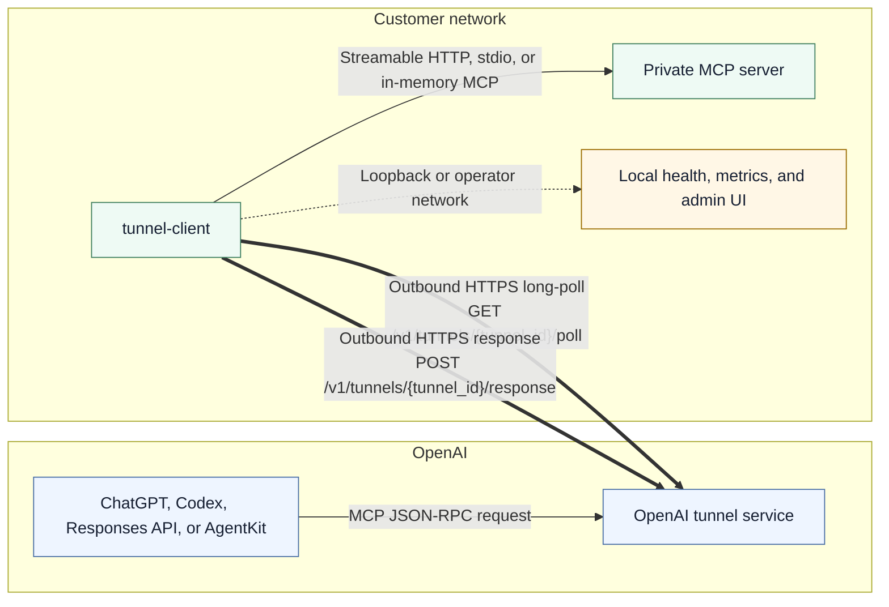
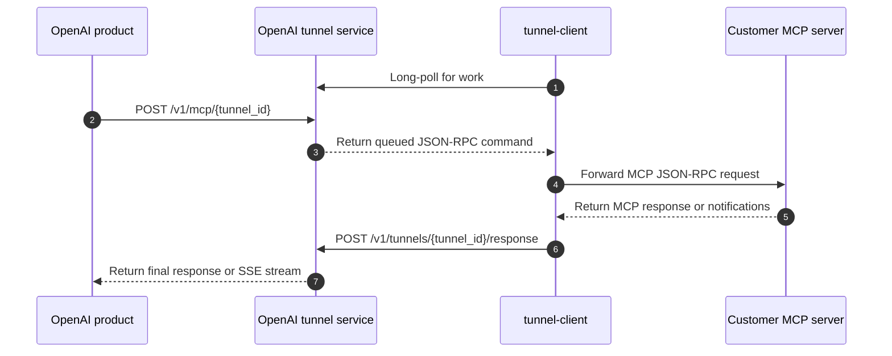
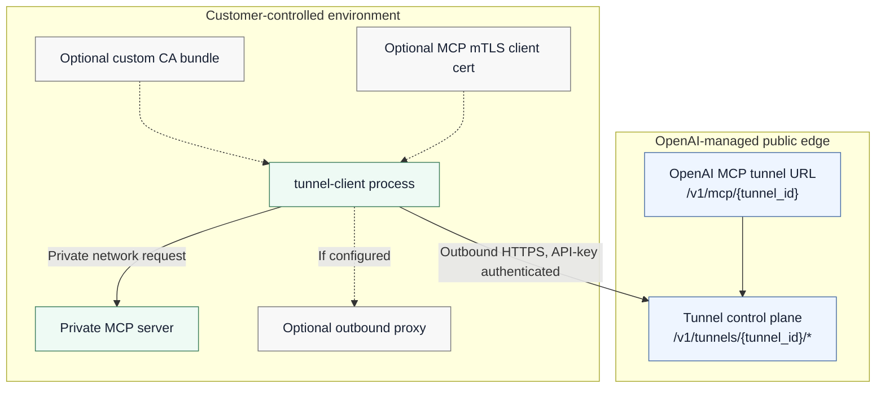
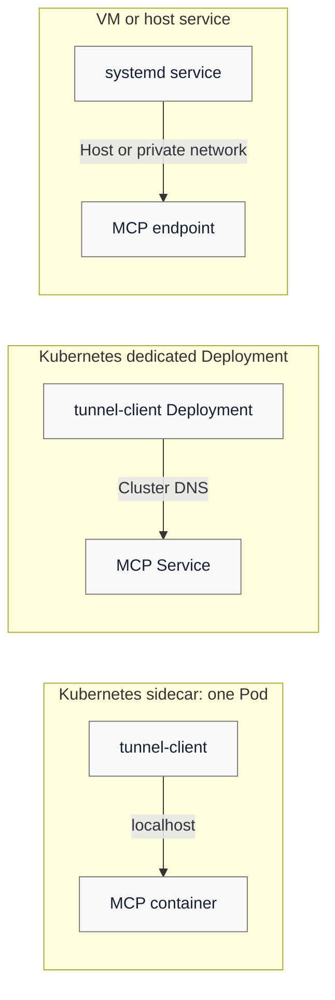

# Architecture

`tunnel-client` connects OpenAI-hosted products to a private MCP server without
requiring the customer to expose that MCP server to the public internet. The
customer runs a small agent inside their network. The agent keeps an outbound
HTTPS connection to the OpenAI tunnel service, receives MCP work, forwards it to
the configured MCP server, and returns the response through the same tunnel.

## Customer-shareable summary

- **No inbound firewall rule is required for the MCP server.** The tunnel client
  initiates all tunnel traffic as outbound HTTPS to OpenAI.
- **The MCP server remains private.** OpenAI products call an OpenAI-hosted MCP
  tunnel URL; the customer's internal MCP URL is only used by the tunnel client.
- **Traffic is request/response with backpressure.** The client long-polls for
  queued work, forwards only the work it can process, and posts the result back
  to OpenAI.
- **Operations stay local.** Health, readiness, metrics, logs, and the optional
  admin UI are exposed by the tunnel client for the customer's operators.

## Solution overview

In the current ChatGPT connector UI, operators attach a tunnel by selecting an
available tunnel or pasting a `tunnel_id`. Under the hood, the product still
targets the OpenAI tunnel service endpoint
`<OPENAI_MCP_TUNNEL_BASE_URL>/v1/mcp/<tunnel_id>`. The tunnel client is
configured separately with the same `tunnel_id`, an API key, and the private
MCP server address that is reachable from inside the customer network. See
[`connectors.md`](connectors.md) for connector-specific setup, channel routing,
and troubleshooting notes.

## Request lifecycle

For streaming requests, JSON-RPC notifications are posted back with
`resp_type=jsonrpc_notify` and forwarded to the connector stream when the
connector requested `text/event-stream`. A final JSON-RPC response closes the
stream.

## Trust boundaries and network paths

Security-relevant defaults:

- The tunnel path requires the tunnel client's control-plane API key.
- The MCP server does not need a public listener.
- The admin UI and log endpoints are loopback-only by default unless
  `--allow-remote-ui` is enabled.
- A custom CA bundle can extend trust for outbound TLS connections.
- MCP mTLS can be configured when the private MCP server requires client
  certificate authentication.
- Raw HTTP logging is disabled by default and should only be enabled for tightly
  controlled debugging sessions.

## Deployment patterns

Choose the pattern that matches the MCP server's deployment model:

- Use a **sidecar** when the MCP server is in the same Pod and can be reached on
  `localhost`.
- Use a **dedicated Deployment** when the MCP server is already exposed through a
  Kubernetes Service and the tunnel client should be upgraded independently.
- Use **VM / systemd** when the MCP server runs on a host or is reachable through
  private networking outside Kubernetes.

## Runtime components

- **CLI / process entry**: `cmd/client` loads config, wires dependencies, and
  starts the app.
- **Configuration**: `pkg/config` handles flags, environment variables,
  validation, and defaults.
- **Control plane**: `pkg/controlplane` builds the HTTP client and runs the
  poll/response loop.
- **Dispatcher**: `pkg/dispatcher` uses a bounded in-memory prefetch queue sized
  by `control-plane.max-inflight`. Requests actively executing against the MCP
  server are limited separately by `mcp.max-concurrent-requests`.
- **MCP client**: `pkg/mcpclient` handles Streamable HTTP MCP, stdio MCP, header
  forwarding, and startup probing.
- **Channel state and admin UI**: `pkg/adminui` exposes channel status, OAuth
  state, Harpoon state, log export, and the embedded web UI.
- **Operations surface**: `pkg/health`, `pkg/metrics`, `pkg/log`, and
  `pkg/process` provide health checks, readiness, Prometheus metrics, structured
  logging, and optional PID-file lifecycle.

## Important behaviors

- **Outbound-only tunnel**: tunnel traffic is initiated by the client. The only
  inbound listener in the client process is the optional local admin/health
  server.
- **Queueing and backpressure**: the poller requests only the number of commands
  that can fit in the bounded queue, up to `25` per poll. A full queue pauses
  polling. When all MCP workers are busy, the dispatcher removes one command
  from the queue and waits for a worker slot. It does not drain another command
  until a slot is free. Local resident work is therefore bounded by the active
  worker limit plus the queue capacity and one dispatcher-held command.
- **Channel routing**: `main` routes to the configured MCP transport. `harpoon`
  routes to the embedded Harpoon server and is enabled only when at least one
  Harpoon target is registered. Additional channels can be configured with
  channel-qualified MCP bindings.
- **Streaming semantics**: requests can stream intermediate JSON-RPC
  notifications over SSE when the connector asks for `text/event-stream`; a
  final JSON-RPC response closes the stream.
- **Connector GET not supported**: `/v1/mcp` accepts POST requests for MCP
  JSON-RPC traffic. GET requests do not provide an SSE stream.

## OAuth-protected MCP

For OAuth-protected MCP servers, the tunnel client and tunnel service preserve
the standard MCP OAuth flow while keeping the MCP server private:

- Inbound `Authorization` headers are forwarded to the MCP server through the
  tunnel client.
- OAuth discovery GETs are queued as tunnel commands and executed from the
  customer's network by the tunnel client.
- `WWW-Authenticate` `resource_metadata` values and discovery payload `resource`
  URLs are rewritten to OpenAI tunnel-service endpoints for the same
  `tunnel_id`.
- `authorization_servers[0]` from Protected Resource Metadata is treated as the
  source of truth for auth-server metadata enrichment and Harpoon OAuth target
  registration.
- Metadata is accepted when the returned `issuer` differs from
  `authorization_servers[0]`, which supports external enterprise identity
  provider issuer URLs while preserving mismatch diagnostics in logs and state.
- The authorization server itself is not tunneled. If the authorization server
  is unreachable from the public internet and from the tunnel-client host, the
  OAuth flow can fail.
