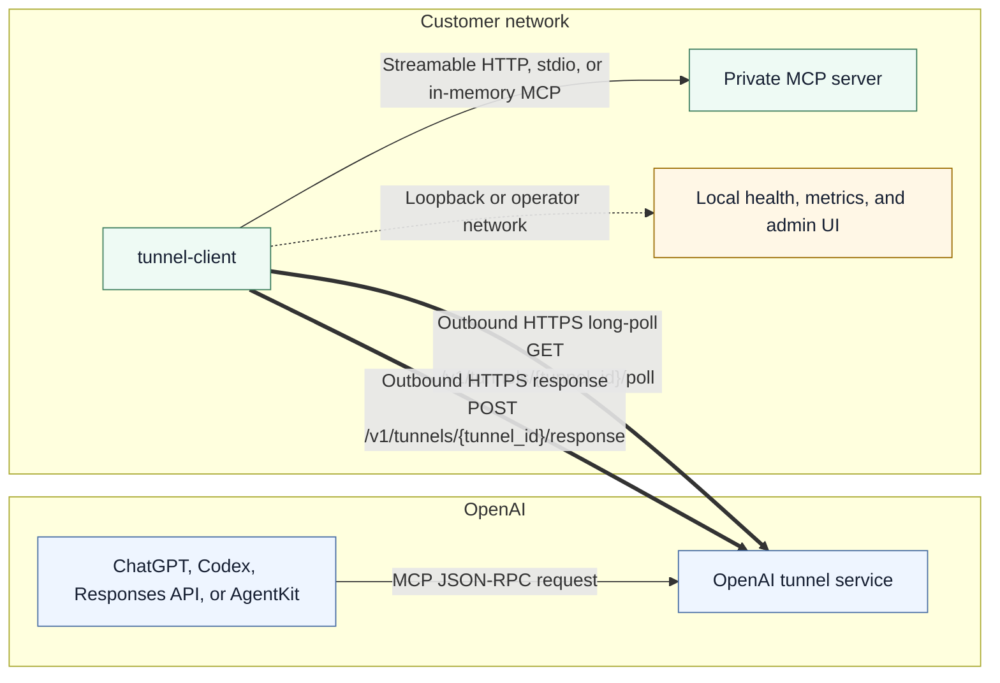
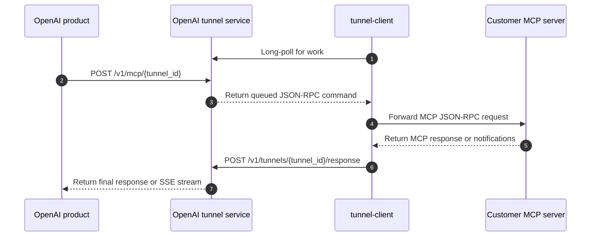
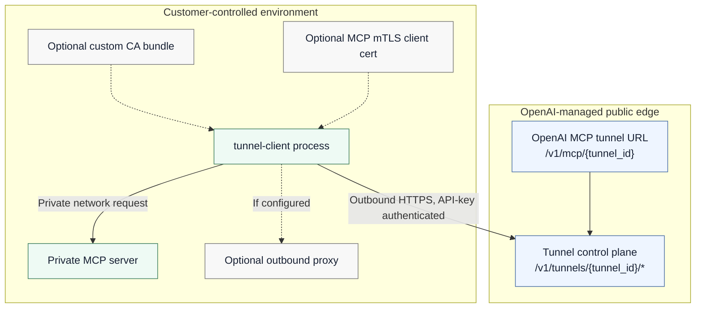
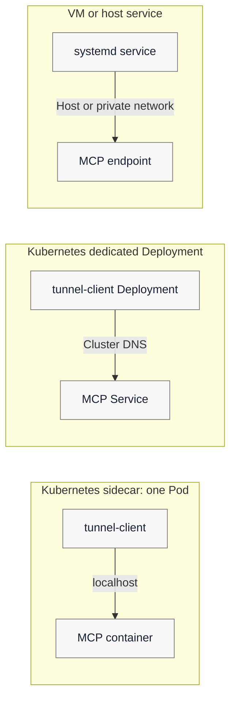

# Architecture

`tunnel-client` connects OpenAI-hosted products to a private MCP server without
requiring the customer to expose that MCP server to the public internet. The
customer runs a small agent inside their network. The agent keeps an outbound
HTTPS connection to the OpenAI tunnel service, receives MCP work, forwards it to
the configured MCP server, and returns the response through the same tunnel.

## Customer-shareable summary

- **No inbound firewall rule is required for the MCP server.** The tunnel client
  initiates all tunnel traffic as outbound HTTPS to OpenAI.
- **The MCP server remains private.** OpenAI products call an OpenAI-hosted MCP
  tunnel URL; the customer's internal MCP URL is only used by the tunnel client.
- **Traffic is request/response with backpressure.** The client long-polls for
  queued work, forwards only the work it can process, and posts the result back
  to OpenAI.
- **Operations stay local.** Health, readiness, metrics, logs, and the optional
  admin UI are exposed by the tunnel client for the customer's operators.

## Solution overview

```mermaid
flowchart LR
  subgraph openai["OpenAI"]
    product["ChatGPT, Codex, Responses API, or AgentKit"]
    tunnel["OpenAI tunnel service"]
  end

  subgraph customer["Customer network"]
    client["tunnel-client"]
    mcp["Private MCP server"]
    ops["Local health, metrics, and admin UI"]
  end

  product -->|"MCP JSON-RPC request"| tunnel
  client ==>|"Outbound HTTPS long-poll<br/>GET /v1/tunnels/{tunnel_id}/poll"| tunnel
  client ==>|"Outbound HTTPS response<br/>POST /v1/tunnels/{tunnel_id}/response"| tunnel
  client -->|"Streamable HTTP, stdio, or in-memory MCP"| mcp
  client -.->|"Loopback or operator network"| ops

  classDef openaiNode fill:#eef5ff,stroke:#4a6fa5,color:#172033
  classDef customerNode fill:#eefaf4,stroke:#3f7f5f,color:#172033
  classDef opsNode fill:#fff7e6,stroke:#9a6b00,color:#172033
  class product,tunnel openaiNode
  class client,mcp customerNode
  class ops opsNode
```

In the current ChatGPT connector UI, operators attach a tunnel by selecting an
available tunnel or pasting a `tunnel_id`. Under the hood, the product still
targets the OpenAI tunnel service endpoint
`<OPENAI_MCP_TUNNEL_BASE_URL>/v1/mcp/<tunnel_id>`. The tunnel client is
configured separately with the same `tunnel_id`, an API key, and the private
MCP server address that is reachable from inside the customer network. See
[`connectors.md`](connectors.md) for connector-specific setup, channel routing,
and troubleshooting notes.

## Request lifecycle

```mermaid
sequenceDiagram
  autonumber
  participant Product as OpenAI product
  participant Tunnel as OpenAI tunnel service
  participant Client as tunnel-client
  participant MCP as Customer MCP server

  Client->>Tunnel: Long-poll for work
  Product->>Tunnel: POST /v1/mcp/{tunnel_id}
  Tunnel-->>Client: Return queued JSON-RPC command
  Client->>MCP: Forward MCP JSON-RPC request
  MCP-->>Client: Return MCP response or notifications
  Client->>Tunnel: POST /v1/tunnels/{tunnel_id}/response
  Tunnel-->>Product: Return final response or SSE stream
```

For streaming requests, JSON-RPC notifications are posted back with
`resp_type=jsonrpc_notify` and forwarded to the connector stream when the
connector requested `text/event-stream`. A final JSON-RPC response closes the
stream.

## Trust boundaries and network paths

```mermaid
flowchart TB
  subgraph internet["OpenAI-managed public edge"]
    edge["OpenAI MCP tunnel URL<br/>/v1/mcp/{tunnel_id}"]
    control["Tunnel control plane<br/>/v1/tunnels/{tunnel_id}/*"]
  end

  subgraph private["Customer-controlled environment"]
    client["tunnel-client process"]
    mcp["Private MCP server"]
    proxy["Optional outbound proxy"]
    ca["Optional custom CA bundle"]
    mtls["Optional MCP mTLS client cert"]
  end

  edge --> control
  client -->|"Outbound HTTPS, API-key authenticated"| control
  client -->|"Private network request"| mcp
  client -.->|"If configured"| proxy
  ca -.-> client
  mtls -.-> client

  classDef public fill:#eef5ff,stroke:#4a6fa5,color:#172033
  classDef privateNode fill:#eefaf4,stroke:#3f7f5f,color:#172033
  classDef option fill:#f8f8f8,stroke:#7a7a7a,color:#172033
  class edge,control public
  class client,mcp privateNode
  class proxy,ca,mtls option
```

Choosing **Connection: Tunnel** changes how an OpenAI product reaches the MCP
server; it does not make MCP authentication or MCP data flow fully local. A
custom app that uses Tunnel keeps the MCP listener private, but its requests,
responses, and applicable auth artifacts still follow the paths below.

### Auth and data flow matrix

| Flow or artifact | Current path | Customer-local part |
| --- | --- | --- |
| MCP JSON-RPC requests, tool arguments, responses, and stream events | Cross the OpenAI product runtime, tunnel-service queue, and the tunnel client's control-plane connection. | Only the final tunnel-client-to-MCP hop is local. |
| Connector-forwarded `Authorization` | Crosses OpenAI with the queued request headers. For HTTP MCP, tunnel-client applies it only to the configured MCP server origin; stdio has no HTTP-header hop. OpenAI-internal, IP-forwarding, fixed proxy/hop-by-hop, and `Connection`-nominated headers are blocked. | A forwarded bearer token is not local-only. |
| Tunnel runtime API key (`CONTROL_PLANE_API_KEY`) | Sent from tunnel-client to OpenAI as bearer auth for poll, response, and metadata control-plane calls; it is not forwarded to the MCP server. | The key can be sourced and stored locally, but it does not remain local. |
| OAuth discovery; DCR, token, and revocation | Connector-facing protected-resource metadata uses the tunnel/Harpoon path. Authorization-server metadata does so only when its issuer was rewritten to a Harpoon-backed route; registered `harpoon://` DCR, token, and revocation endpoints do as well. Their requests and responses cross OpenAI. Public `http(s)` OAuth endpoints remain unchanged and are called by the product OAuth caller rather than through Tunnel. | For registered targets, the final Harpoon call originates inside the customer network. |
| Browser authorization | The OAuth shim does not rewrite `authorization_endpoint`; the supported auto-registered path leaves the browser to contact the upstream authorization server directly. | The browser-to-authorization-server hop is direct. |
| OAuth callback and authorization-code exchange | The callback target is selected by the product/app OAuth flow. In the OpenAI connector flow, OpenAI receives and processes the callback/code and performs the token exchange; a shimmed token endpoint changes only the final hop. Client credentials, refresh tokens, and token responses remain in that product OAuth path when present. | For a shimmed token endpoint, the final tunnel-client/Harpoon-to-authorization-server hop is local. |
| Env- or file-backed `MCP_EXTRA_HEADERS` | For HTTP MCP, values are resolved by tunnel-client and injected only for the configured MCP server origin: the exact MCP path for runtime requests, and the same origin for discovery/probe requests. This mechanism does not send them to the OpenAI control plane or unrelated auth-server hosts; connector-forwarded headers apply last and can override them. | A static HTTP backend credential can stay on the tunnel-client-to-MCP hop. Stdio has no HTTP-header injection. |
| MCP-side mTLS | Applies only to `http-streamable` MCP. The private key stays local and the client certificate is presented only to the configured MCP origin; it is not control-plane auth. | The TLS handshake is on the HTTP tunnel-client-to-MCP hop. Stdio has no TLS hop, and non-HTTP binding mTLS is rejected. |

### Choosing the right path

- **Strict-local-auth is not supported by Tunnel.** If every bearer token or
  auth artifact must stay outside OpenAI, do not use Secure MCP Tunnel for that
  requirement.
- **Local credential injection and MCP-side mTLS are narrower supported
  cases.** For HTTP MCP, use env- or file-backed `MCP_EXTRA_HEADERS` when a
  static backend credential must be added only on the final MCP hop, or
  MCP-side mTLS when the private key must stay customer-side. MCP payloads and
  results still traverse OpenAI.
- `MCP_EXTRA_HEADERS` is static configuration; it is not dynamic,
  short-lived, per-request token generation.
- **For Codex, use a direct local MCP configuration instead of Tunnel** when
  strict-local-auth is required: stdio, loopback HTTP, or private HTTP that is
  reachable from the Codex host. Do not configure raw
  `/v1/mcp/{tunnel_id}` as a Codex MCP URL. Tool content still enters the
  normal Codex/model data path. See the
  [Codex MCP documentation](https://developers.openai.com/codex/extend/mcp).

### Security-review triage

Before deciding whether Tunnel fits a customer's requirement, ask:

- Which target surface is involved: ChatGPT, a custom app, API, AgentKit, or
  Codex?
- Which auth mode is in use: no auth, forwarded bearer, OAuth, static header,
  or mTLS?
- Which specific artifacts are prohibited from crossing OpenAI: tool payloads,
  bearer tokens, authorization codes, refresh tokens, client secrets, private
  keys, or all of them?
- Is a local loopback proxy allowed?

Security-relevant defaults:

- Tunnel-client control-plane calls require the tunnel client's runtime API key;
  this key is separate from MCP-server authentication.
- The MCP server does not need a public listener.
- The admin UI and log endpoints are loopback-only by default unless
  `--allow-remote-ui` is enabled.
- A custom CA bundle can extend trust for outbound TLS connections.
- MCP mTLS can be configured when the private MCP server requires client
  certificate authentication.
- Raw HTTP logging is disabled by default and should only be enabled for tightly
  controlled debugging sessions.

## Deployment patterns

```mermaid
flowchart LR
  subgraph sidecar["Kubernetes sidecar: one Pod"]
    podclient["tunnel-client"]
    podmcp["MCP container"]
    podclient -->|"localhost"| podmcp
  end

  subgraph dedicated["Kubernetes dedicated Deployment"]
    deployclient["tunnel-client Deployment"]
    svcmcp["MCP Service"]
    deployclient -->|"Cluster DNS"| svcmcp
  end

  subgraph vm["VM or host service"]
    systemd["systemd service"]
    hostmcp["MCP endpoint"]
    systemd -->|"Host or private network"| hostmcp
  end

  classDef pattern fill:#f8f8f8,stroke:#7a7a7a,color:#172033
  class podclient,podmcp,deployclient,svcmcp,systemd,hostmcp pattern
```

Choose the pattern that matches the MCP server's deployment model:

- Use a **sidecar** when the MCP server is in the same Pod and can be reached on
  `localhost`.
- Use a **dedicated Deployment** when the MCP server is already exposed through a
  Kubernetes Service and the tunnel client should be upgraded independently.
- Use **VM / systemd** when the MCP server runs on a host or is reachable through
  private networking outside Kubernetes.

## Runtime components

- **CLI / process entry**: `cmd/client` loads config, wires dependencies, and
  starts the app.
- **Configuration**: `pkg/config` handles flags, environment variables,
  validation, and defaults.
- **Control plane**: `pkg/controlplane` builds the HTTP client and runs the
  poll/response loop.
- **Dispatcher**: `pkg/dispatcher` uses a bounded in-memory prefetch queue sized
  by `control-plane.max-inflight`. Requests actively executing against the MCP
  server are limited separately by `mcp.max-concurrent-requests`.
- **MCP client**: `pkg/mcpclient` handles Streamable HTTP MCP, stdio MCP, header
  forwarding, and startup probing.
- **Channel state and admin UI**: `pkg/adminui` exposes channel status, OAuth
  state, Harpoon state, log export, and the embedded web UI.
- **Operations surface**: `pkg/health`, `pkg/metrics`, `pkg/log`, and
  `pkg/process` provide health checks, readiness, Prometheus metrics, structured
  logging, and optional PID-file lifecycle.

## Important behaviors

- **Outbound-only tunnel**: tunnel traffic is initiated by the client. The only
  inbound listener in the client process is the optional local admin/health
  server.
- **Queueing and backpressure**: the poller requests only the number of commands
  that can fit in the bounded queue, up to `25` per poll. A full queue pauses
  polling. When all MCP workers are busy, the dispatcher removes one command
  from the queue and waits for a worker slot. It does not drain another command
  until a slot is free. Local resident work is therefore bounded by the active
  worker limit plus the queue capacity and one dispatcher-held command.
- **Channel routing**: `main` routes to the configured MCP transport. `harpoon`
  routes to the embedded Harpoon server and is enabled only when at least one
  Harpoon target is registered. Additional channels can be configured with
  channel-qualified MCP bindings.
- **Streaming semantics**: requests can stream intermediate JSON-RPC
  notifications over SSE when the connector asks for `text/event-stream`; a
  final JSON-RPC response closes the stream.
- **Connector GET not supported**: `/v1/mcp` accepts POST requests for MCP
  JSON-RPC traffic. GET requests do not provide an SSE stream.

## OAuth-protected MCP

For OAuth-protected MCP servers, the tunnel client and tunnel service preserve
the standard MCP OAuth flow while keeping the MCP server private:

- Inbound `Authorization` headers are forwarded to the MCP server through the
  tunnel client.
- Connector-facing protected-resource discovery GETs are queued as tunnel
  commands and executed from the customer's network by the tunnel client.
- `WWW-Authenticate` `resource_metadata` values and discovery payload `resource`
  URLs are rewritten to OpenAI tunnel-service endpoints for the same
  `tunnel_id`.
- `authorization_servers[0]` from Protected Resource Metadata is treated as the
  source of truth for auth-server metadata enrichment and Harpoon OAuth target
  registration.
- Metadata is accepted when the returned `issuer` differs from
  `authorization_servers[0]`, which supports external enterprise identity
  provider issuer URLs while preserving mismatch diagnostics in logs and state.
- Registered `harpoon://` `registration_endpoint`, `token_endpoint`, and
  `revocation_endpoint` values are rewritten to Tunnel OAuth-shim routes.
  Their POST requests and responses traverse Tunnel and Harpoon; public
  `http(s)` endpoint URLs remain unchanged and are called by the product OAuth
  caller rather than through Tunnel.
- A caller that needs to sign `private_key_jwt` for a shimmed token endpoint
  can explicitly GET the shim token URL first. Tunnel service asks a
  supporting tunnel client for the exact upstream token endpoint audience and
  returns only that value; older clients keep the existing POST proxy behavior
  and fail this optional lookup closed.
- The OAuth shim does not rewrite `authorization_endpoint`; the supported
  auto-registered path leaves browser authorization direct to the upstream
  authorization server. Tunnel does not expose arbitrary authorization-server
  routes.
