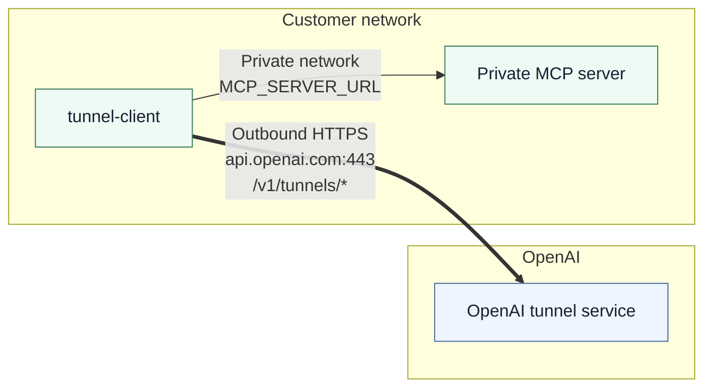

# Deployment Overview

This section covers common ways to run `tunnel-client` and the network
requirements it needs. See [`../architecture.md`](../architecture.md) for the
customer-shareable architecture diagrams.

## Required egress

Your environment must allow `tunnel-client` to make **outbound HTTPS**
connections to:

- **Host**: `api.openai.com`
- **Port**: `443/TCP`
- **Paths**: `/v1/tunnels/*`

No inbound ports are required for the tunnel itself.

`tunnel-client` must also be able to reach your internal MCP server at the
configured `MCP_SERVER_URL`.

## Outbound proxy environments

If your network requires an outbound proxy, configure explicit proxy flags so
that control-plane, MCP, and Harpoon traffic routes through the proxy. Explicit
proxy flags override environment proxy variables and ignore `NO_PROXY` for the
affected targets.

Common options:

- `--http-proxy=<url|env:VAR>` for a global proxy.
- `--control-plane.http-proxy=<url|env:VAR>` to force control-plane traffic through a proxy.
- `--mcp.http-proxy=<url|env:VAR>` or per-channel `--mcp.server-url="...,http-proxy=<url|env:VAR>"`.
- `--harpoon.http-proxy=<url|env:VAR>` for Harpoon outbound calls.

When no explicit proxy is set for a target, standard `HTTP_PROXY` / `HTTPS_PROXY` / `NO_PROXY` semantics apply.

For a ready-made profile, `tunnel-client profiles add corp-proxy --sample sample_mcp_enterprise_proxy ...`
materializes a YAML profile with `http_proxy: env:HTTPS_PROXY` and
`ca_bundle: env:ENTERPRISE_CA_BUNDLE`.

## Choose a deployment pattern

- **Docker**: [`docker.md`](docker.md)
- **Bundled Cloudflare companion**: [`cloudflared.md`](cloudflared.md)
- **Kubernetes sidecar**: [`kubernetes-sidecar.md`](kubernetes-sidecar.md)
- **Kubernetes dedicated pod**: [`kubernetes-dedicated.md`](kubernetes-dedicated.md)
- **VM / systemd**: [`systemd-vm.md`](systemd-vm.md)
