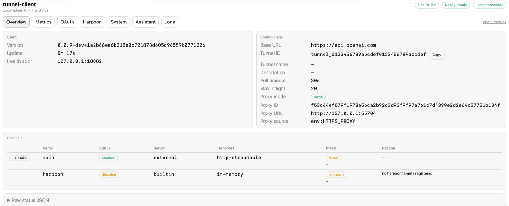

# Tunnel End-User Guide

<div class="hero-shell">
  <div class="hero-copy">
    <p class="eyebrow">OpenAI tunnel-client</p>
    <p class="hero-deck">Connect a local or private MCP server to ChatGPT and Codex without exposing it to the public internet.</p>
    <div class="pill-row">
      <span class="pill">Permissions and groups</span>
      <span class="pill">Tunnel creation</span>
      <span class="pill">Local /ui checks</span>
      <span class="pill">ChatGPT connector</span>
      <span class="pill">Codex workflows</span>
    </div>
  </div>
  
</div>

This guide is the shortest complete operator path from "I have a private MCP server" to
"ChatGPT and Codex can reach it through a tunnel." It keeps the control-plane values, local
runtime steps, and product setup screens in one place so you do not need to stitch together four
different docs or a Slack thread first.

<div class="callout-grid">
  <div class="callout">
    <p class="eyebrow">What you need</p>
    <ul>
      <li>A private or local MCP server that tunnel-client can reach.</li>
      <li>A <code>tunnel_id</code> from OpenAI Platform Tunnels management.</li>
      <li>A supported <code>tunnel-client</code> binary from Platform Tunnels management or the latest public release.</li>
      <li>A runtime API key for the long-lived daemon.</li>
      <li>An admin key only if you will create, list, update, or delete tunnels from the CLI.</li>
    </ul>
  </div>
  <div class="callout accent">
    <p class="eyebrow">What usually blocks operators</p>
    <p><code>tunnel_id</code> is not the same thing as the runtime API key, and a tunnel showing up in Platform does not automatically mean it will appear in ChatGPT. This guide calls out those boundaries directly.</p>
  </div>
</div>

## What tunnel-client does

`tunnel-client` is the customer-run process that keeps an outbound-only HTTPS connection open to
the OpenAI tunnel control plane. It receives work for one tunnel, forwards that work to your MCP
server, and exposes local operator surfaces at `/healthz`, `/readyz`, `/metrics`, and `/ui`.

If you want the shortest local discovery path first, run:

```bash
tunnel-client help quickstart
```

## Before you start


Use these exact setup pages when you need to create or inspect values:

- Tunnels management and supported tunnel-client download: `https://platform.openai.com/settings/organization/tunnels`
- Latest public tunnel-client release: `https://github.com/openai/tunnel-client/releases/latest`
- Organization roles: `https://platform.openai.com/settings/organization/people/roles`
- Organization groups: `https://platform.openai.com/settings/organization/people/groups`
- Runtime API keys: `https://platform.openai.com/settings/organization/api-keys`
- Admin API keys: `https://platform.openai.com/settings/organization/admin-keys`
- ChatGPT connector settings: `https://chatgpt.com/#settings/Connectors`

Keep these three values straight:

<div class="key-grid">
  <div class="key-card">
    <p class="eyebrow">CONTROL_PLANE_TUNNEL_ID</p>
    <p class="key-label">Where you get it</p>
    <p>Platform Tunnels management, or <code>tunnel-client admin tunnels create|list|get ...</code>.</p>
    <p class="key-label">What it is for</p>
    <p>Identifies the tunnel object that ChatGPT and tunnel-client must both use.</p>
    <p class="key-label">When you need it</p>
    <p>Always.</p>
  </div>
  <div class="key-card">
    <p class="eyebrow">CONTROL_PLANE_API_KEY</p>
    <p class="key-label">Where you get it</p>
    <p>Platform Runtime API keys.</p>
    <p class="key-label">What it is for</p>
    <p>Authenticates <code>tunnel-client doctor</code> and <code>tunnel-client run</code>.</p>
    <p class="key-label">When you need it</p>
    <p>Always.</p>
  </div>
  <div class="key-card">
    <p class="eyebrow">OPENAI_ADMIN_KEY</p>
    <p class="key-label">Where you get it</p>
    <p>Platform Admin API keys.</p>
    <p class="key-label">What it is for</p>
    <p>Authenticates <code>tunnel-client admin tunnels list|create|update|delete</code>.</p>
    <p class="key-label">When you need it</p>
    <p>Only for tunnel CRUD.</p>
  </div>
</div>

The permission split is equally important:

- Runtime users need Tunnels **Read** + **Use**.
- Tunnel managers need Tunnels **Read** + **Manage**.
- People who create admin keys need the Platform admin-key permission in addition to any tunnel permissions they need.

<div class="figure-grid two-up">
  <figure class="shot">
    
    <figcaption>Reused checked-in capture: Platform &gt; Organization roles &gt; Tunnels permissions.</figcaption>
  </figure>
  <figure class="shot">
    
    <figcaption>Reused checked-in capture: Platform &gt; Organization groups &gt; assign the tunnel role to the right operator group.</figcaption>
  </figure>
</div>

If you are creating roles and groups from scratch:

1. Create a runtime-user role with Tunnels **Read** + **Use**.
2. Create a manager role with Tunnels **Read** + **Manage**, plus **Use** if the same people also run the daemon or configure the connector.
3. Assign those roles to groups instead of editing people one by one.
4. After the role assignment is in place, create new runtime or admin keys if practical, then rerun `tunnel-client doctor --explain`.

## Create the tunnel

The tunnel itself is the shared anchor between Platform, ChatGPT, and your local runtime. You can
create it from the Platform Tunnels page or with the admin-key-backed CLI path:

```bash
tunnel-client admin tunnels create \
  --name "Production MCP Tunnel" \
  --description "Routes ChatGPT connector traffic to the production MCP server" \
  --organization-id <ORG_ID> \
  --workspace-id <WORKSPACE_ID>
```

<figure class="shot wide">
  
  <figcaption>Reused checked-in capture: Platform &gt; Tunnels &gt; Create tunnel modal.</figcaption>
</figure>

Two details matter here:

- The runtime daemon and the ChatGPT connector must use the same `tunnel_id`.
- If the tunnel should appear in a ChatGPT workspace picker, create it with the correct workspace
  scope. A tunnel can exist in Platform and still not appear in ChatGPT if the workspace wiring or
  connector permissions are wrong.

Use the Platform UI when you want the cleanest self-serve path. Use the admin CLI path when you
already have `OPENAI_ADMIN_KEY` and need repeatable create, list, or update operations.

## Get to first success in the terminal

The shortest supported binary-first path is to let the CLI explain itself before you hand-edit
configuration:

```bash
tunnel-client help quickstart
tunnel-client help doctor
tunnel-client help plugin
```

If you already have a tunnel ID and want the smallest end-to-end demo:

```bash
export CONTROL_PLANE_API_KEY="sk-..."
tunnel-client run \
  --embedded-mcp-stub \
  --control-plane.tunnel-id tunnel_0123456789abcdef0123456789abcdef \
  --health.listen-addr 127.0.0.1:0 \
  --health.url-file /tmp/tunnel-client-health.url
curl -fsS "$(cat /tmp/tunnel-client-health.url)/readyz"
open "$(cat /tmp/tunnel-client-health.url)/ui"
```

If you want a named profile instead of the one-command demo path:

```bash
tunnel-client init \
  --sample sample_mcp_stdio_local \
  --profile local-stdio \
  --tunnel-id tunnel_0123456789abcdef0123456789abcdef \
  --mcp-command "python /path/to/server.py"
tunnel-client doctor --profile local-stdio --explain
tunnel-client run --profile local-stdio
```

What to look for:

- `/healthz` returns HTTP 200 when the process is alive.
- `/readyz` returns HTTP 200 when the startup checks and downstream MCP readiness checks have passed.
- `/ui` gives you the local operator dashboard.

If `doctor --explain` says the runtime key is missing, fix `CONTROL_PLANE_API_KEY`.
If Platform knows the tunnel but ChatGPT does not, fix the workspace or connector permissions before
you assume the daemon is wrong.

## Check the local UI


The local UI is where you confirm the runtime is really alive, not just launched. The screenshots
below were captured from live local runs, with the Overview tab refreshed on May 21, 2026.

<div class="figure-grid quad">
  <figure class="shot">
    
    <figcaption>Overview: health, readiness, tunnel, and MCP status in one place.</figcaption>
  </figure>
  <figure class="shot">
    
    <figcaption>Metrics: quick read of the exported Prometheus counters from <code>/metrics</code>.</figcaption>
  </figure>
  <figure class="shot">
    
    <figcaption>Logs: live stream, filtering, and support-bundle export.</figcaption>
  </figure>
  <figure class="shot">
    
    <figcaption>Assistant: Codex status, login state, and bridge activity from the same local runtime.</figcaption>
  </figure>
</div>

When you are checking a local run, use this order:

1. Open `/readyz`. If it is not ready, the connector will not be reliable yet.
2. Open `/ui#overview` to confirm the active tunnel and MCP target.
3. Open `/ui#metrics` when you want a quick read on request volume or readiness counters.
4. Open `/ui#logs` when you need the real error message instead of guessing from symptoms.
5. Open `/ui#codex` when you are validating the Codex bridge, login state, or plugin setup.

<figure class="shot wide">
  
  <figcaption>Reused checked-in capture: local Logs tab export confirmation. Use this when you need a redacted support bundle for debugging.</figcaption>
</figure>

## Connect ChatGPT

Once the local runtime is healthy, open `https://chatgpt.com/#settings/Connectors` and choose
**Connection: Tunnel**. Then select the tunnel or paste the `tunnel_id`.

<figure class="shot wide">
  
  <figcaption>Reused checked-in capture: ChatGPT &gt; Settings &gt; Connectors &gt; Connection: Tunnel.</figcaption>
</figure>

Leave `tunnel-client run ...` running while you do this. The daemon must stay up for connector
discovery and every later MCP tool call.

If the tunnel does not appear in ChatGPT:

- Confirm the tunnel was created with the correct workspace scope.
- Confirm the connector operator has Tunnels **Read** + **Use**.
- Confirm the daemon is still healthy and `/readyz` is passing.
- Confirm the tunnel is not so new that the control plane is still propagating it.

## Use it from Codex


You have two supported Codex paths:

- `tunnel-client codex assistant ...` for the shortest terminal assistant bridge.
- `tunnel-client codex plugin install` plus the native `tunnel-client runtimes ...` and
  `tunnel-client admin-profiles ...` commands when you want the persistent local plugin surface.

Useful commands:

```bash
tunnel-client codex assistant "Summarize what tunnel-client is for."
tunnel-client codex status
tunnel-client codex plugin install
tunnel-client runtimes list
tunnel-client runtimes status <alias>
tunnel-client admin-profiles list
```

If you are attaching to an existing tunnel instead of creating one:

```bash
tunnel-client runtimes connect \
  --alias prod-mcp \
  --tunnel-id tunnel_0123456789abcdef0123456789abcdef \
  --runtime-api-key env:CONTROL_PLANE_API_KEY \
  --mcp-server-url https://mcp.example.com/mcp
```

### Starter phrases for Codex

Copy these exactly when you want Codex to take the first operator steps for you:

- `Figure out what tunnel-client is for from the binary help, then get me to /ui with the shortest local path.`
- `I only have the source checkout. Figure out how to build tunnel-client, then get me to /ui with the shortest local path.`
- `Use tunnel-client to create or reuse a profile, run doctor --explain, and then start the daemon.`
- `Run tunnel-client codex assistant and summarize what this checkout is for in one sentence.`
- `Install the Codex plugin from the tunnel-client binary, connect the provided tunnel id, and tell me whether the runtime is launched, healthy, or ready.`
- `Use tunnel-client runtimes to attach a local MCP server to an existing tunnel id and report the ui_url.`

## FAQ

### Where do I get `CONTROL_PLANE_TUNNEL_ID`?

From Platform Tunnels management, or from `tunnel-client admin tunnels create|list|get ...` if you
already have `OPENAI_ADMIN_KEY`.

### Where do I get `CONTROL_PLANE_API_KEY`?

From Platform Runtime API keys. This is the key that `tunnel-client doctor` and `tunnel-client run`
expect.

### When do I need `OPENAI_ADMIN_KEY`?

Only when you are creating, listing, updating, or deleting tunnels through the admin CLI. Do not
swap the admin key in for the long-lived daemon.

### Why can the tunnel exist in Platform but still not appear in ChatGPT?

Usually one of three reasons: the tunnel was created without the correct workspace scope, the
connector operator does not have Tunnels **Use**, or the local daemon is not running and ready.

### How do I tell whether the local runtime is healthy enough for ChatGPT or Codex?

Check `/readyz` first. Then open `/ui#overview` and `/ui#logs`. A launched process is not enough;
the runtime needs to be ready.

### Should I use Platform or the admin CLI to create the tunnel?

Use Platform when you want the clearest self-serve operator path. Use the admin CLI when you need a
repeatable scriptable flow and you already have the admin key.

## Companion docs

Use this guide for the main operator journey, then fall through to the deeper references when you
need them:

- [`permissions.md`](permissions.md) for the complete roles and groups walkthrough
- [`onboarding.md`](onboarding.md) for the broader CLI-first startup paths
- [`configuration.md`](configuration.md) for the full runtime, logs, metrics, and assistant surface
- [`connectors.md`](connectors.md) for connector transport and auth behavior
- [`enterprise-customer-onboarding.md`](enterprise-customer-onboarding.md) for the customer-shareable architecture explanation
