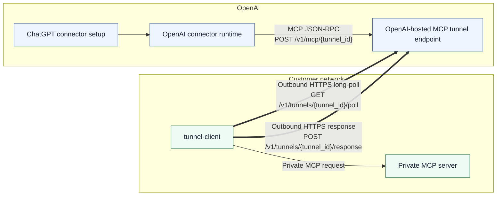

# Secure MCP Tunnel: Enterprise Customer Onboarding

This document is designed to be shared with an enterprise customer. It explains
how to:

- Create and manage a **tunnel** in the OpenAI tunnel control plane.
- Deploy the **tunnel client** inside your network to reach your internal MCP
  server.
- Configure a **connector** in ChatGPT to use the **OpenAI-hosted MCP tunnel
  URL**.

## What you are setting up

You will **not** expose your MCP server publicly. Instead, an outbound-only
tunnel client inside your network pulls work from OpenAI and forwards it to your
MCP server.



For a deeper explanation and more diagrams, see
[`architecture.md`](architecture.md).

## Glossary

- **Tunnel**: A logical identifier that binds together:
  - the connector's ChatGPT tunnel selection (or pasted tunnel ID), and
  - the tunnel-client instance configured with that same identifier.
- **Tunnel ID (`tunnel_id`)**: The identifier used in:
  - ChatGPT connector setup: selected from the tunnel dropdown or pasted into
    the tunnel ID field
  - tunnel-client control plane: `/v1/tunnels/{tunnel_id}/poll` and
    `/v1/tunnels/{tunnel_id}/response`
  - Format: `tunnel_` followed by 32 lowercase hexadecimal characters.
- **OpenAI-hosted MCP tunnel endpoint**: The OpenAI-managed virtual MCP server
  endpoint that ChatGPT targets for the selected `tunnel_id`.
- **Tunnel Client**: A customer-run process that:
  - long-polls OpenAI for MCP requests for its `tunnel_id`, and
  - forwards them to your MCP server.

## Key concept: two different URLs

- **Current ChatGPT connector UI uses Tunnel mode**, where the operator either:
  - selects an available tunnel from the dropdown, or
  - pastes a `tunnel_id` manually.

- **Under the hood**, ChatGPT still sends requests to the OpenAI-hosted MCP
  tunnel endpoint for that tunnel:

```text
<OPENAI_MCP_TUNNEL_BASE_URL>/v1/mcp/<tunnel_id>
```

- **Tunnel client uses the Tunnel control-plane base URL** (host root) and
  derives:

```text
<CONTROL_PLANE_BASE_URL>/v1/tunnels/<tunnel_id>/poll
<CONTROL_PLANE_BASE_URL>/v1/tunnels/<tunnel_id>/response
```

## What OpenAI provides to you

OpenAI will provide, or your rollout will let you create:

- **OpenAI MCP tunnel base URL** (the base host to use in the connector UI)
- **Tunnel control-plane base URL** for the tunnel client (defaults to
  `https://api.openai.com` unless OpenAI provides a different rollout host)
- **Tunnel client API key** (for tunnel client authentication)
- **Tunnel management (admin) API access** so you can create/manage tunnel IDs
  (if applicable for your rollout)

You will provide:

- **Your MCP server URL** (reachable from wherever you run the tunnel client)

---

## Step 1 - Create (or obtain) a tunnel ID

Depending on your rollout, either:

1. **Create a tunnel for you** and provide the resulting `tunnel_id`, or
2. Let you create one yourself from Platform tunnel settings or the **Tunnel Management API**.

Use these exact setup pages when you need to create or inspect the handoff values:

- Tunnels management and supported tunnel-client download:
  `https://platform.openai.com/settings/organization/tunnels`
- Organization roles:
  `https://platform.openai.com/settings/organization/people/roles`
- Organization groups:
  `https://platform.openai.com/settings/organization/people/groups`
- Runtime API keys:
  `https://platform.openai.com/settings/organization/api-keys`
- Admin API keys:
  `https://platform.openai.com/settings/organization/admin-keys`
- ChatGPT connector settings:
  `https://chatgpt.com/#settings/Connectors`

### Prerequisite: permission to manage or use tunnels

Before anyone creates keys or tunnels, assign the Platform roles described in
[`permissions.md`](permissions.md):

- Runtime daemon operators and the principal that creates `CONTROL_PLANE_API_KEY`
  need Tunnels **Read** + **Use**.
- Tunnel CRUD operators need Tunnels **Read** + **Manage**.
- Operators who create `OPENAI_ADMIN_KEY` need Platform admin-key permission in
  addition to the tunnel permissions needed for their workflow.

When creating `CONTROL_PLANE_API_KEY` in Platform Runtime API keys, choose
**Restricted** and select Tunnels **Read** + **Use**. Do not use **All** or an
admin key for the long-lived daemon.

The Platform UI maps those labels to these permission atoms:

- `api.organization.tunnel.read`
- `api.organization.tunnel.write`
- `api.organization.tunnel.use`

If you do not have the right permission, tunnel CRUD can fail with `403`. If a
tunnel is created without the ChatGPT workspace ID, it may be visible in
Platform but absent from the ChatGPT connector tunnel picker.

### Tunnel Management API (admin endpoints)

These endpoints manage **tunnel metadata**. They do not deploy the tunnel client
for you.

- **Create**: `POST /v1/tunnels`
- **Get**: `GET /v1/tunnels/{tunnel_id}`
- **List**: `GET /v1/tunnels?organization_id=...` *or*
  `workspace_id=...` *or* `tenant_id=...`
- **Update**: `POST /v1/tunnels/{tunnel_id}`
- **Delete**: `DELETE /v1/tunnels/{tunnel_id}`

**AuthZ note:** `list`, `create`, `update`, and `delete` require an **admin API
key** plus Tunnels **Manage** (`api.organization.tunnel.write`) in the caller's
active organization/workspace context. `get <tunnel_id>` can use the runtime key
for read-only metadata lookup.

### Example: create a tunnel

```bash
curl -X POST <TUNNEL_MGMT_API_BASE_URL>/v1/tunnels \
  -H "Authorization: Bearer $OPENAI_ADMIN_KEY" \
  -H "Content-Type: application/json" \
  -d '{
    "name": "BigCo Prod MCP Tunnel",
    "description": "Routes BigCo connector traffic to the on-prem MCP server",
    "workspace_ids": ["<WORKSPACE_ID>"]
  }'
```

The response includes the new tunnel's `id`. Use this as your **`tunnel_id`**.

---

### CLI helper (preferred for quick setup)

You can manage tunnels with the bundled `tunnel-client admin tunnels` commands
instead of crafting raw `curl` requests.

Prereqs:

- Set an **admin key**: `export OPENAI_ADMIN_KEY=<admin key>`
- Optional: override the control plane host (defaults to prod):
  `export CONTROL_PLANE_BASE_URL=https://api.openai.com`
- Provide at least one scope flag: `--organization-id` and/or `--workspace-id`
  (duplicates are rejected).

Examples:

```bash
# Create (requires at least one org/workspace id)
bin/tunnel-client admin tunnels create \
  --name "BigCo Prod MCP Tunnel" \
  --description "Routes BigCo connector traffic to the on-prem MCP server" \
  --workspace-id "<WORKSPACE_ID>"

# After create succeeds, wait 25-30 seconds before expecting the tunnel to be active and ready.

# List by workspace (exactly one filter required: org OR workspace OR tenant)
bin/tunnel-client admin tunnels list --workspace-id "<WORKSPACE_ID>" --json

# Get by id
bin/tunnel-client admin tunnels get "<tunnel_id>"

# Update (PUT-like replacement for org/workspace lists when flags are present)
bin/tunnel-client admin tunnels update "<tunnel_id>" \
  --name "Renamed Tunnel" \
  --organization-id "<ORG_ID>"

# Delete (requires --confirm)
bin/tunnel-client admin tunnels delete "<tunnel_id>" --confirm
```

Use `--json` on any subcommand for structured output.

---

## Step 2 - Configure the connector in ChatGPT

When creating a connector in **ChatGPT**, use **Connection: Tunnel**.

Then either:

- select the tunnel from the **Available tunnels** dropdown, or
- paste the `tunnel_id` into the tunnel field if it is not listed yet.

Do **not** paste your private MCP server URL into ChatGPT.

### What to enter in ChatGPT

- **Connection mode**: `Tunnel`
- **Tunnel value**: your `tunnel_id` (for example
  `tunnel_0123456789abcdef0123456789abcdef`)

### Legacy/internal note

Older or internal setup surfaces may still refer to an **MCP Server URL** and
show the underlying OpenAI-hosted endpoint shape:

```text
<OPENAI_MCP_TUNNEL_BASE_URL>/v1/mcp/<tunnel_id>
```

That URL shape remains the transport path used by OpenAI, but in the current
ChatGPT UI operators should choose **Tunnel** mode and provide the `tunnel_id`,
not the full URL.

### What the connector sends (for reference)

Connectors send a single JSON-RPC object per request:

- **Method**: `POST`
- **Path**: `/v1/mcp/{tunnel_id}`
- **Body**: a JSON-RPC object (example format):

```json
{ "jsonrpc":"2.0", "id":1, "method":"tools/call", "params":{ "name":"...", "arguments":{} } }
```

Optional session header (used for MCP session continuity):

- `Mcp-Session-Id: <session-id>`

> You do not need to manage connector authentication headers; those are handled by the OpenAI connector runtime.

---

## Step 3 - Deploy the tunnel client in your environment

You can run the tunnel client as a:

- **host binary** (VM / server / systemd)
- **Docker container**
- **Kubernetes sidecar** (same Pod as MCP server) or **dedicated Deployment**

Open Platform tunnel settings, then use the download link there or the latest
public tunnel-client release from:

`https://github.com/openai/tunnel-client/releases/latest`

If you already have a binary, start with the supported CLI path before hand-editing
configuration:

```bash
tunnel-client help quickstart
export CONTROL_PLANE_API_KEY="sk-..."
tunnel-client init \
  --sample sample_mcp_stdio_local \
  --profile local-stdio \
  --tunnel-id tunnel_0123456789abcdef0123456789abcdef \
  --mcp-command "python /path/to/server.py"
tunnel-client doctor --profile local-stdio --explain
tunnel-client run --profile local-stdio
```

For an HTTP MCP server, switch to
`--sample sample_mcp_remote_no_auth` and use
`--mcp-server-url https://mcp.internal.example.com/mcp` instead of
`--mcp-command`.

### Network requirements

From the tunnel client host/network:

- **Outbound HTTPS** to the tunnel control plane base URL (port 443)
- **Outbound HTTP(S)** to your MCP server URL (`MCP_SERVER_URL`)
- No inbound ports are required for the tunnel itself

### Required configuration (tunnel client)

You must configure:

- `CONTROL_PLANE_API_KEY`: tunnel client auth (provided by OpenAI)
- `CONTROL_PLANE_TUNNEL_ID`: your `tunnel_id` from Step 1
- `MCP_SERVER_URL` or `MCP_COMMAND`: your internal MCP endpoint or local stdio
  command, reachable from the tunnel client

Recommended configuration:

- `CONTROL_PLANE_BASE_URL`: the control-plane host root (provided by OpenAI; defaults to `https://api.openai.com`)
- `CONTROL_PLANE_MAX_INFLIGHT_REQUESTS`: local polled-command buffer capacity
  (default `20`); a full buffer pauses polling
- `MCP_MAX_CONCURRENT_REQUESTS`: requests actively dispatched to the MCP server
  (default `10`); this is separate from the local buffer capacity
- `LOG_FORMAT=json` and `LOG_LEVEL=info` for production logs

Optional control-plane mTLS configuration:

- `CONTROL_PLANE_CLIENT_CERT`: path to the PEM client certificate for OpenAI control-plane HTTPS
- `CONTROL_PLANE_CLIENT_KEY`: path to the PEM client private key paired with `CONTROL_PLANE_CLIENT_CERT`
- When those are configured with the default `CONTROL_PLANE_BASE_URL=https://api.openai.com`, tunnel-client automatically calls `https://mtls.api.openai.com`.
- Control-plane mTLS is additive to `CONTROL_PLANE_API_KEY`; it does not replace API-key auth.
- If the runtime API key's org/project requires API mTLS and no valid control-plane certificate is presented, the control-plane request fails with code `certificate_required`.

Optional mTLS configuration for MCP server authentication:

- `MCP_CLIENT_CERT`: path to PEM client certificate used for outbound MCP HTTPS
- `MCP_CLIENT_KEY`: path to PEM client private key (must be paired with `MCP_CLIENT_CERT`)

Do not reuse `MCP_CLIENT_CERT` / `MCP_CLIENT_KEY` for the OpenAI control-plane hop;
those settings authenticate tunnel-client to the customer MCP server, while
`CONTROL_PLANE_CLIENT_CERT` / `CONTROL_PLANE_CLIENT_KEY` authenticate tunnel-client
to OpenAI's mTLS API endpoint.

Operational helpers (optional):

- `HEALTH_LISTEN_ADDR` (default `127.0.0.1:8080`; set to `:8080` only when a trusted remote probe needs access, or `127.0.0.1:0` only when you explicitly want an ephemeral loopback port)
- `HEALTH_URL_FILE` (write resolved health URL; recommended with `HEALTH_LISTEN_ADDR=:0`)
- `PID_FILE` (write pid on start, remove on stop)

### Configuration examples

#### Host binary

```bash
export CONTROL_PLANE_API_KEY="sk-..."
export CONTROL_PLANE_TUNNEL_ID="<tunnel_id>"
export MCP_SERVER_URL="https://mcp.internal.example.com/mcp"
export CONTROL_PLANE_BASE_URL="<CONTROL_PLANE_BASE_URL>"

./tunnel-client run --log.level=info --log.format=json
```

#### Docker

```bash
docker run --rm \
  -e CONTROL_PLANE_API_KEY="sk-..." \
  -e CONTROL_PLANE_TUNNEL_ID="<tunnel_id>" \
  -e CONTROL_PLANE_BASE_URL="<CONTROL_PLANE_BASE_URL>" \
  -e MCP_SERVER_URL="https://mcp.internal.example.com/mcp" \
  -e LOG_LEVEL="info" \
  -e LOG_FORMAT="json" \
  -e HEALTH_LISTEN_ADDR=":8080" \
  -p 8080:8080 \
  tunnel-client:latest
```

#### Kubernetes (sidecar pattern)

```yaml
apiVersion: v1
kind: Pod
metadata:
  name: mcp-with-tunnel
spec:
  containers:
    - name: mcp-server
      image: your-mcp-image:latest
      ports:
        - containerPort: 3000
    - name: tunnel-client
      image: tunnel-client:latest
      env:
        - name: CONTROL_PLANE_TUNNEL_ID
          value: <tunnel_id>
        - name: CONTROL_PLANE_BASE_URL
          value: <CONTROL_PLANE_BASE_URL>
        - name: MCP_SERVER_URL
          value: http://127.0.0.1:3000/mcp
        - name: CONTROL_PLANE_API_KEY
          valueFrom:
            secretKeyRef:
              name: openai-api-key
              key: api_key
      ports:
        - name: health
          containerPort: 8080
      livenessProbe:
        httpGet: { path: /healthz, port: health }
      readinessProbe:
        httpGet: { path: /readyz, port: health }
```

### Health and metrics

The tunnel client exposes:

- `GET /healthz`
- `GET /readyz`
- `GET /metrics` (Prometheus)

By default these endpoints bind to loopback. If you set `HEALTH_LISTEN_ADDR=:8080`
for Docker or Kubernetes probes, keep that port on a trusted container, Pod, or
operator network.

---

## Step 4 - Validate end-to-end

### 1) Validate the tunnel client is running

```bash
curl -fsS "http://127.0.0.1:8080/healthz"
curl -fsS "http://127.0.0.1:8080/readyz"
```

### 2) Validate traffic reaches your MCP server

In the ChatGPT connector UI:

- Save the connector configuration after selecting a tunnel or pasting the
  `tunnel_id`.
- Run a "test connection" / "test tool call" flow (if available).

On your MCP server, confirm you observe:

- a JSON-RPC request arriving, and
- the corresponding response being generated.

---

## How the tunnel works (deeper detail)

### Connector-facing endpoint: `/v1/mcp/{tunnel_id}`

- The OpenAI-hosted MCP tunnel endpoint receives one JSON-RPC request.
- It enqueues the request under your `tunnel_id`.
- It waits, with the HTTP request held open, for the tunnel client to return the
  final response.
- If the connector includes `Accept: text/event-stream`, the response is streamed
  as SSE. JSON-RPC notifications are forwarded as they arrive, and a final
  JSON-RPC response closes the stream.
- `GET /v1/mcp` is not supported; connectors must use POST.

### Tunnel-client control-plane endpoints: `/v1/tunnels/{tunnel_id}/poll` and `/response`

- The tunnel client long-polls `/poll` for queued work.
  - Response is `204 No Content` when no work is available.
  - Response is `200 OK` with a list of commands when work is available.
- The tunnel client posts results to `/response` (including:
  - `request_id`,
  - final JSON-RPC response payload (or JSON-RPC notifications), and
  - selected response headers and status code from the MCP server).
- JSON-RPC notifications are sent with `resp_type=jsonrpc_notify` and are
  forwarded to the connector stream when SSE is enabled.

### Timeouts (high level)

Timeouts are configurable by OpenAI. Typical behaviors:

- Connector requests may time out if the MCP server does not respond in time.
- Long-poll requests complete periodically so the tunnel client can reconnect
  quickly.

If you expect long-running MCP calls, coordinate timeout values with OpenAI.

---

## Current limitations (important)

- **SSE is opt-in**: connectors must send `Accept: text/event-stream` to receive
  streamed notifications. Otherwise they receive a single `application/json`
  response.
- The OpenAI tunnel queueing and timeout behavior is optimized for deterministic
  request/response flows.

---

## Operations & best practices

- **Redundant tunnel clients**: multiple active `tunnel-client` instances may
  poll the same `tunnel_id` when they target equivalent MCP backends that are
  stateless or provide session affinity/shared session state, such as a single
  HTTP MCP host or a load balancer that keeps MCP sessions sticky to the right
  backend. Tunnel service keeps one shared queue per tunnel and does not assign
  messages to a specific `tunnel-client` replica. Each queued message is
  delivered to whichever replica polls it first. For `stdio`, `localhost`, or
  non-sticky per-replica MCP servers, related session messages can land on
  different clients/backends and fail. In those cases, keep one `tunnel-client`
  per tunnel or use distinct tunnel IDs per replica.
- **Secrets hygiene**: treat all API keys/tokens as secrets; store them in a
  secrets manager and rotate them on your standard cadence.
- **Logging safety**: do not enable raw HTTP logging except in tightly controlled
  debugging sessions, as it can expose sensitive headers/bodies.
