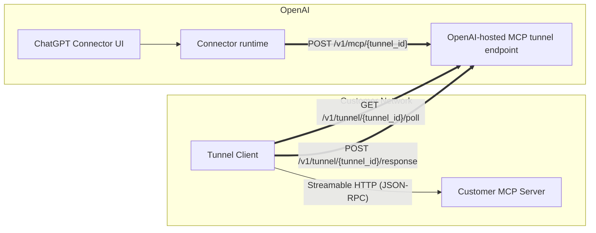

# Enterprise Customer Onboarding: MCP Tunnels

This document is designed to be shared with an enterprise customer. It explains how to:

- Create and manage a **tunnel** in the OpenAI tunnel control plane.
- Deploy the **tunnel client** inside your network to reach your internal MCP server.
- Configure a **connector** in ChatGPT to use the **OpenAI-hosted MCP tunnel URL**.

## What you’re setting up (quick mental model)

You will **not** expose your MCP server publicly. Instead, an outbound-only tunnel client inside your network “pulls” work from OpenAI and forwards it to your MCP server.



## Glossary

- **Tunnel**: A logical identifier that binds together:
  - a connector’s “MCP URL”, and
  - the tunnel-client instance configured with that same identifier.
- **Tunnel ID (`tunnel_id`)**: The identifier used in:
  - connector URL: `/v1/mcp/{tunnel_id}`
  - tunnel-client control plane: `/v1/tunnel/{tunnel_id}/poll` and `/v1/tunnel/{tunnel_id}/response`
  - Format: `tunnel_` followed by 32 lowercase letters or digits.
- **OpenAI-hosted MCP tunnel URL**: The URL you paste into the connector configuration UI. It is an OpenAI-hosted “virtual MCP server” endpoint.
- **Tunnel Client**: A customer-run process that:
  - long-polls OpenAI for MCP requests for its `tunnel_id`, and
  - forwards them to your MCP server.

## Key concept: two different URLs

- **Connector UI uses the OpenAI-hosted MCP tunnel URL**:

```text
<OPENAI_MCP_TUNNEL_BASE_URL>/v1/mcp/<tunnel_id>
OPENAI_MCP_TUNNEL_BASE_URL = https://tunnel-service.gateway.unified-0.internal.api.openai.org
```

- **Tunnel client uses the Tunnel control-plane base URL** (host root) and derives:

```text
<CONTROL_PLANE_BASE_URL>/v1/tunnel/<tunnel_id>/poll
<CONTROL_PLANE_BASE_URL>/v1/tunnel/<tunnel_id>/response
```

## What OpenAI provides to you

OpenAI will provide:

- **OpenAI MCP tunnel base URL** (the base host you will use in the connector UI)
- **Tunnel control-plane base URL** for the tunnel client
- **Tunnel client API key** (for tunnel client authentication)
- **Tunnel management (admin) API access** so you can create/manage tunnel IDs (if applicable for your rollout)

You will provide:

- **Your MCP server URL** (reachable from wherever you run the tunnel client)

---

## Step 1 — Create (or obtain) a tunnel ID

Depending on your rollout, OpenAI may either:

1. **Create a tunnel for you** and provide the resulting `tunnel_id`, or
2. Provide access to the **Tunnel Management API** so you can create it yourself.

### Prerequisite: permission to manage tunnels

Before you can create/update/delete tunnels via the **Tunnel Management API** (`/v1/tunnels*`), you must:

- Use an **admin API key** (not the tunnel-client `CONTROL_PLANE_API_KEY`).
- Have the **tunnel management permission** in your org/workspace context:
  - **Organization-scoped**: `api.organization.tunnel.write`
  - **Workspace-scoped**: `chatgpt.workspace.tunnel.write`

If you do not have this permission, `POST /v1/tunnels` will fail with `403` (“missing tunnel management permission”). If your admin API key is not operating in an organization or workspace context, it will fail with `400` (“Tunnel must be created with an active organization or workspace context.”).

If OpenAI has not already provisioned this permission for your admins, an org admin can grant it using Organization RBAC.

#### Example (org-scoped): create a “Tunnel Managers” group and assign tunnel-write permission

> These RBAC calls require an **org admin API key** with permission to manage groups/roles in your organization.

**1) Create a group**

```bash
curl -X POST https://api.openai.com/v1/organization/groups \
  -H "Authorization: Bearer $OPENAI_ADMIN_KEY" \
  -H "Content-Type: application/json" \
  -d '{
      "name": "Tunnel Managers"
  }'
```

**2) Create a Role with Tunnel Permissions**

```bash
curl -X POST https://api.openai.com/v1/organization/roles \
  -H "Authorization: Bearer $OPENAI_ADMIN_KEY" \
  -H "Content-Type: application/json" \
  -d '{
      "role_name": "API Tunnel Manager",
      "permissions": [
          "api.organization.tunnel.write"
      ],
      "description": "Allows managing organization tunnels"
  }'
```

**3) Get the group id and role id from previous steps and assign the role to the group**

```bash
curl -X POST https://api.openai.com/v1/organization/groups/<group_id>/roles \
  -H "Authorization: Bearer $OPENAI_ADMIN_KEY" \
  -H "Content-Type: application/json" \
  -d '{
      "role_id": "<role_id>"
  }'
```

**4) Add the admin user(s) to the group (Note you can also do this in https://platform.openai.com/settings/organization/people/groups)**

```bash
curl -X POST https://api.openai.com/v1/organization/groups/<group_id>/users \
  -H "Authorization: Bearer $OPENAI_ADMIN_KEY" \
  -H "Content-Type: application/json" \
  -d '{
      "user_id": "<user_id>"
  }'
```

After this, the admin user(s) who will call `/v1/tunnels*` should have the tunnel management permission through group membership (you can also manage group membership via your organization admin UI/tooling).

### Tunnel Management API (admin endpoints)

These endpoints manage **tunnel metadata** (they do not deploy the tunnel client for you):

- **Create**: `POST /v1/tunnels`
- **Get**: `GET /v1/tunnels/{tunnel_id}`
- **List**: `GET /v1/tunnels?organization_id=...` *or* `workspace_id=...` *or* `tenant_id=...`
- **Update**: `POST /v1/tunnels/{tunnel_id}`
- **Delete**: `DELETE /v1/tunnels/{tunnel_id}`

**AuthZ note:** these endpoints require an **admin API key** and a principal with tunnel management permission (for example `api.organization.tunnel.write`) in the caller’s active org/workspace context.

### Example: create a tunnel

```bash
curl -X POST <TUNNEL_MGMT_API_BASE_URL>/v1/tunnels \
  -H "Authorization: Bearer $OPENAI_ADMIN_KEY" \
  -H "Content-Type: application/json" \
  -d '{
    "name": "BigCo Prod MCP Tunnel",
    "description": "Routes BigCo connector traffic to the on-prem MCP server",
    "workspace_ids": ["<WORKSPACE_ID>"]
  }'
```

The response includes the new tunnel’s `id`. Use this as your **`tunnel_id`**.

---

### CLI helper (preferred for quick setup)

You can manage tunnels with the bundled `tunnel-client admin tunnels` commands instead of crafting raw `curl` requests.

Prereqs:

- Set an **admin key**: `export OPENAI_ADMIN_KEY=<admin key>`
- Optional: override the control plane host (defaults to prod): `export CONTROL_PLANE_BASE_URL=https://api.openai.com`
- Provide at least one scope flag: `--organization-id` and/or `--workspace-id` (duplicates are rejected).

Examples:

```bash
# Create (requires at least one org/workspace id)
bin/tunnel-client admin tunnels create \
  --name "BigCo Prod MCP Tunnel" \
  --description "Routes BigCo connector traffic to the on-prem MCP server" \
  --workspace-id "<WORKSPACE_ID>"

# List by workspace (exactly one filter required: org OR workspace OR tenant)
bin/tunnel-client admin tunnels list --workspace-id "<WORKSPACE_ID>" --json

# Get by id
bin/tunnel-client admin tunnels get "<tunnel_id>"

# Update (PUT-like replacement for org/workspace lists when flags are present)
bin/tunnel-client admin tunnels update "<tunnel_id>" \
  --name "Renamed Tunnel" \
  --organization-id "<ORG_ID>"

# Delete (requires --confirm)
bin/tunnel-client admin tunnels delete "<tunnel_id>" --confirm
```

Use `--json` on any subcommand for structured output.

---

## Step 2 — Configure the connector to use the OpenAI-hosted MCP tunnel URL

When creating a connector in **ChatGPT**, you’ll be asked for the **MCP Server URL**.

Paste the **OpenAI-hosted MCP tunnel URL** (not your internal MCP URL):

```text
<OPENAI_MCP_TUNNEL_BASE_URL>/v1/mcp/<tunnel_id>
```

### What the connector sends (for reference)

Connectors send a single JSON-RPC object per request:

- **Method**: `POST`
- **Path**: `/v1/mcp/{tunnel_id}`
- **Body**: a JSON-RPC object (example format):

```json
{ "jsonrpc":"2.0", "id":1, "method":"tools/call", "params":{ "name":"...", "arguments":{} } }
```

Optional session header (used for MCP session continuity):

- `Mcp-Session-Id: <session-id>`

> You do not need to manage connector authentication headers; those are handled by the OpenAI connector runtime.

---

## Step 3 — Deploy the tunnel client in your environment

You can run the tunnel client as a:

- **host binary** (VM / server / systemd)
- **Docker container**
- **Kubernetes sidecar** (same Pod as MCP server) or **dedicated Deployment**

### Network requirements

From the tunnel client host/network:

- **Outbound HTTPS** to the tunnel control plane base URL (port 443)
- **Outbound HTTP(S)** to your MCP server URL (`MCP_SERVER_URL`)
- No inbound ports are required for the tunnel itself

### Required configuration (tunnel client)

You must configure:

- `CONTROL_PLANE_API_KEY`: tunnel client auth (provided by OpenAI)
- `CONTROL_PLANE_TUNNEL_ID`: your `tunnel_id` from Step 1
- `MCP_SERVER_URL`: your internal MCP endpoint (reachable from the tunnel client)

Recommended configuration:

- `CONTROL_PLANE_BASE_URL`: the control-plane host root (provided by OpenAI; defaults to `https://api.openai.com`)
- `CONTROL_PLANE_MAX_INFLIGHT_REQUESTS`: buffer size / backpressure (default `20`)
- `MCP_MAX_CONCURRENT_REQUESTS`: MCP parallelism (default `10`)
- `LOG_FORMAT=json` and `LOG_LEVEL=info` for production logs

Operational helpers (optional):

- `HEALTH_LISTEN_ADDR` (default `:8080`)
- `HEALTH_URL_FILE` (write resolved health URL when binding to port `0`)
- `PID_FILE` (write pid on start, remove on stop)

### Configuration examples

#### Host binary

```bash
export CONTROL_PLANE_API_KEY="sk-..."
export CONTROL_PLANE_TUNNEL_ID="<tunnel_id>"
export MCP_SERVER_URL="https://mcp.internal.example.com/mcp"
export CONTROL_PLANE_BASE_URL="<CONTROL_PLANE_BASE_URL>"

./tunnel-client run --log.level=info --log.format=json
```

#### Docker

```bash
docker run --rm \
  -e CONTROL_PLANE_API_KEY="sk-..." \
  -e CONTROL_PLANE_TUNNEL_ID="<tunnel_id>" \
  -e CONTROL_PLANE_BASE_URL="<CONTROL_PLANE_BASE_URL>" \
  -e MCP_SERVER_URL="https://mcp.internal.example.com/mcp" \
  -e LOG_LEVEL="info" \
  -e LOG_FORMAT="json" \
  -e HEALTH_LISTEN_ADDR=":8080" \
  -p 8080:8080 \
  tunnel-client:latest
```

#### Kubernetes (sidecar pattern)

```yaml
apiVersion: v1
kind: Pod
metadata:
  name: mcp-with-tunnel
spec:
  containers:
    - name: mcp-server
      image: your-mcp-image:latest
      ports:
        - containerPort: 3000
    - name: tunnel-client
      image: tunnel-client:latest
      env:
        - name: CONTROL_PLANE_TUNNEL_ID
          value: <tunnel_id>
        - name: CONTROL_PLANE_BASE_URL
          value: <CONTROL_PLANE_BASE_URL>
        - name: MCP_SERVER_URL
          value: http://127.0.0.1:3000/mcp
        - name: CONTROL_PLANE_API_KEY
          valueFrom:
            secretKeyRef:
              name: openai-api-key
              key: api_key
      ports:
        - name: health
          containerPort: 8080
      livenessProbe:
        httpGet: { path: /healthz, port: health }
      readinessProbe:
        httpGet: { path: /readyz, port: health }
```

### Health and metrics

The tunnel client exposes:

- `GET /healthz`
- `GET /readyz`
- `GET /metrics` (Prometheus)

---

## Step 4 — Validate end-to-end

### 1) Validate the tunnel client is running

```bash
curl -fsS "http://127.0.0.1:8080/healthz"
curl -fsS "http://127.0.0.1:8080/readyz"
```

### 2) Validate traffic reaches your MCP server

In the ChatGPT connector UI:

- Save the connector configuration with the OpenAI-hosted MCP tunnel URL.
- Run a “test connection” / “test tool call” flow (if available).

On your MCP server, confirm you observe:

- a JSON-RPC request arriving, and
- the corresponding response being generated.

---

## How the tunnel works (deeper detail)

### Connector-facing endpoint: `/v1/mcp/{tunnel_id}`

- The OpenAI-hosted MCP tunnel endpoint receives one JSON-RPC request.
- It enqueues the request under your `tunnel_id`.
- It waits (holds the HTTP request open) for the tunnel client to return the final response.

### Tunnel-client control-plane endpoints: `/v1/tunnel/{tunnel_id}/poll` and `/response`

- The tunnel client long-polls `/poll` for queued work.
  - Response is `204 No Content` when no work is available.
  - Response is `200 OK` with a list of commands when work is available.
- The tunnel client posts results to `/response` (including:
  - `request_id`,
  - final JSON-RPC response payload, and
  - selected response headers and status code from the MCP server).

### Timeouts (high level)

Timeouts are configurable by OpenAI. Typical behaviors:

- Connector requests may time out if the MCP server does not respond in time.
- Long-poll requests complete periodically so the tunnel client can reconnect quickly.

If you expect long-running MCP calls, coordinate timeout values with OpenAI.

---

## Current limitations (important)

- **No SSE / streaming** responses end-to-end. MCP servers should return final `application/json` responses.
- **No progress notifications forwarded** back to the connector today.
- The OpenAI tunnel queueing and timeout behavior is optimized for deterministic request/response flows.

---

## Operations & best practices

- **One tunnel client per tunnel ID**: run a single active `tunnel-client` instance per `tunnel_id` unless OpenAI explicitly advises otherwise.
- **Secrets hygiene**: treat all API keys/tokens as secrets; store in a secrets manager and rotate on your standard cadence.
- **Logging safety**: do not enable raw HTTP logging except in tightly controlled debugging sessions, as it can expose sensitive headers/bodies.
